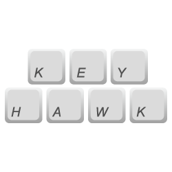

<p align="center">
  
</p>

<h1 align="center">Keyhawk</h1>

<p align="center">Keyhawk is used to create and manage keybinds for your JavaScript game.<p>

<div align="center">
  <a href="#"></a>
  <a href="#"></a>
  <a href="#"></a>
  <a href="#"></a>
</div>

Keyhawk lets you easily and quickly create keybinds for your JavaScript games. Keybinds are creating by assigning one or more keys to be bound and then passing a method that should be run when the keybind is active (the keys for it are pressed) and an optional delay that can be used to limit how often the keybind can be used.

Keyhawk also gives you the option of using the default game loop module that is used to check for which keys are pressed or you can use your own loop and just use the exposed API.

## **Installation**

Keyhawk is an ES6 module that can be used by downloading the package through NPM:

```
$ npm install keyhawk
```

## **Initialization**

Keyhawk upon initialization can be passed an options object and for now there is just one option that can be specified.

| param           | type    | description                                                                                                        | default |
|-----------------|---------|--------------------------------------------------------------------------------------------------------------------|---------|
| options         | Object  |                                                                                                                    | {}      |
| options.useLoop | boolean | Indicates whether Keyhawk should use the default game loop module for checking if a keybind is actively being used | true    |


## **Basic Example**

To begin using Keyhawk, simply import the default module from wherever its located and specify as an option of whether you would like to use the built in game loop or not.

```js
import Keyhawk from './path/to/keyhawk.js';


const keyhawk = new Keyhawk();
```

## **Creating Keybinds**

To create a new keybind, you start out by using the `keybind` method which takes a variable amount of arguments depending on how many keys you want to use.

The keys that can be assigned to a keybind should be derived from the `keyhawk.KEY` Object as these have been normalized and ensured to work.

An example of creating a single key keybind can be done as shown:

```js
keyhawk.keybind(keyhawk.KEY.A);
```

or you can add as many keys as you would like:

```js
keyhawk.keybind(keyhawk.KEY.SPACE, keyhawk.KEY.CTRL, keyhawk.KEY.W);
```

**Note:** Order of the keys does not matter.

Just this keybind on its own doesn't do much as there's no action associated with it. To add a function to run when the keybind is active, you can specify an action:

```js
function hello() {

    console.log('Hello!');

}

keyhawk.keybind(keyhawk.KEY.A).action(hello);
```

This will run the `hello` method everytime the keybind is active.

Notice how `action` can be chained, this is because `keybind` returns an instance of the keybind and so it could be written as:

```js
function hello() {

    console.log('Hello!');

}

const sayHello = keyhawk.keybind(keyhawk.KEY.A);

sayHello.action(hello);
```

Lastly, you can add a delay to the keybind so that a certain amount of time has to pass between uses. This does not apply to the very first press though which means that if you set a delay of 5000ms you don't have to wait 5000ms to use it for the first time it will be available immediately but after that it will rest for 5000ms.

```js
function hello() {

    console.log('Hello!');

}

const sayHello = keyhawk.keybind(keyhawk.KEY.A).action(hello).delay(5000);
```

### **initialDelay**

Sets the initial delay before the keybind can be used for the first time

| param 	| type   	| description                                              	| default 	|
|-------	|--------	|----------------------------------------------------------	|---------	|
| ms    	| number 	| The time in milliseconds before the keybind can be used. 	|         	|

```js
keyhawk.initialDelay(5000);
```

### **Disable/Enable**

To diable the use of any and all keybinds you can call the disable method.

```js
keyhawk.disable();
```

This method also takes an optional parameter which specifies how long you want keybinds to be disabled for. So for instance if you used `keyhawk.disable(10000)` all keybinds are going to be disabled for 10 seconds and they will be enabled again. If no time is provided then it is set to Infinity and you will have to call 

```js
keyhawk.enable();
```
to re-enable the use of keybinds.

## **Using Your Own Game Loop**

If you are already using a game loop for another purpose then you should set the `useLoop` option to `false` so that the Keyhawk game loop and your game loop aren't both running at the same time. Keyhawk exposes the `update` method which is what checks for active keybinds and you can call that within your project inside of your game loop.

```js
const keyhawk = new Keyhawk({ useLoop: false });

// Set up your keybinds here...

// And inside of your game loop, call the following method providing the current time from your loop:
keyhawk.check(time);
```

## **License**

MIT